## SI 工程相对路径设置

[参考链接](https://mp.weixin.qq.com/s/7sDLoNgSwfco_OawTOg9QA)

你的 SI 工程是不是换个目录就不能用了？每次 clone 下来的代码都要重新新建 SI 工程？是否已经厌烦了这种开发方式，说实话，鱼鹰也早已厌烦，这就是鱼鹰为什么还是习惯使用 KEIL 编辑代码的原因（有新建工程的功夫，代码已经改好了）。

鱼鹰早就知道了 SI 可以设置相对路径，曾经也尝试过，但都失败了，直到今天，鱼鹰才算搞定了，所以写下了本篇教程，希望更多的人掌握这种方法，提高工作效率，如果有帮助，欢迎转发支持鱼鹰，让更多的道友掌握该技能。

注意：

SI 版本 4.0，顺序很重要，一定要按教程顺序操作，路径中不要有中文。

假设有工程目录名 linux-2.6.22.6，目录中有如下源文件：

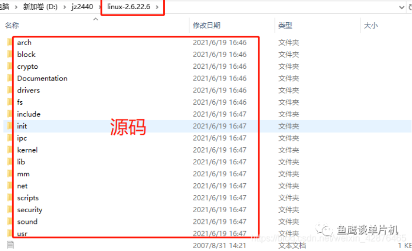

新建一个 si 文件夹（必须）

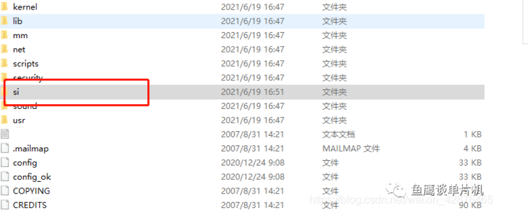

打开 source insight 软件，新建工程：

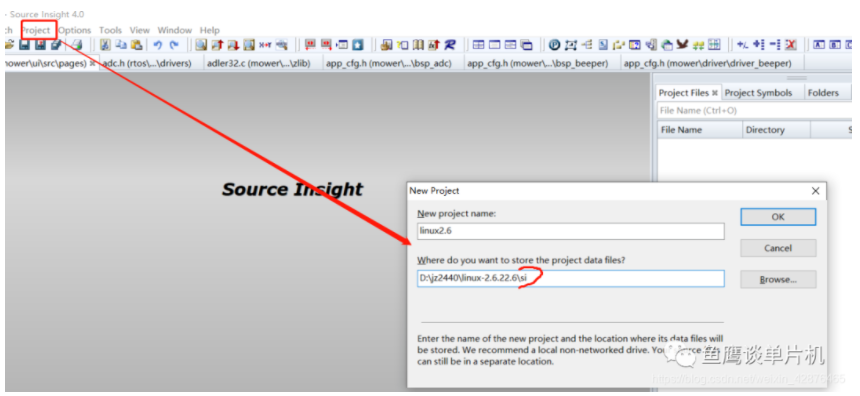

输入工程名 linux2.6 ，资源管理器进入 si 目录，复制路径到上图中

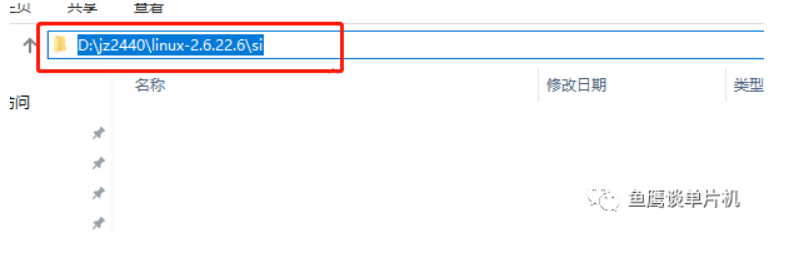

点击 OK，此时进入下一个界面，将 si 去掉：

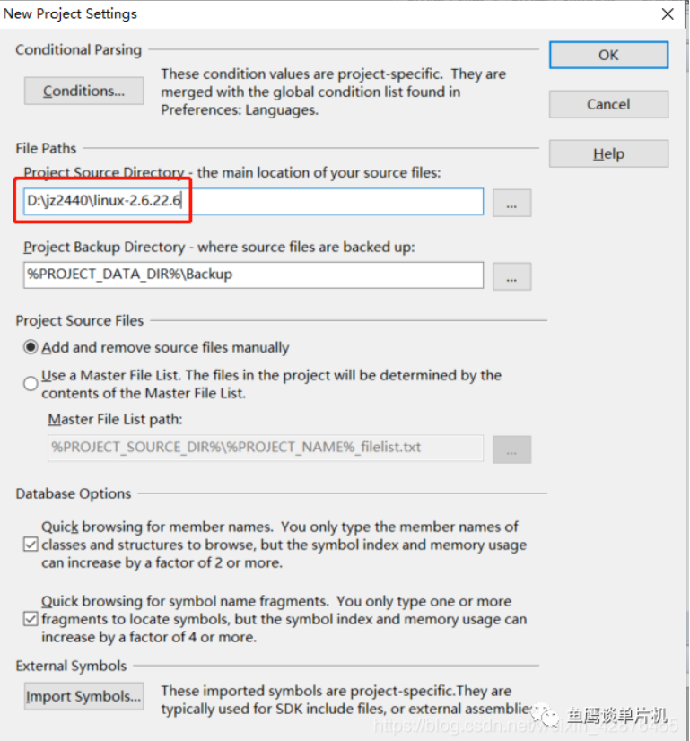

点击 OK ，如果让你添加文件，不能添加，直接 close 。

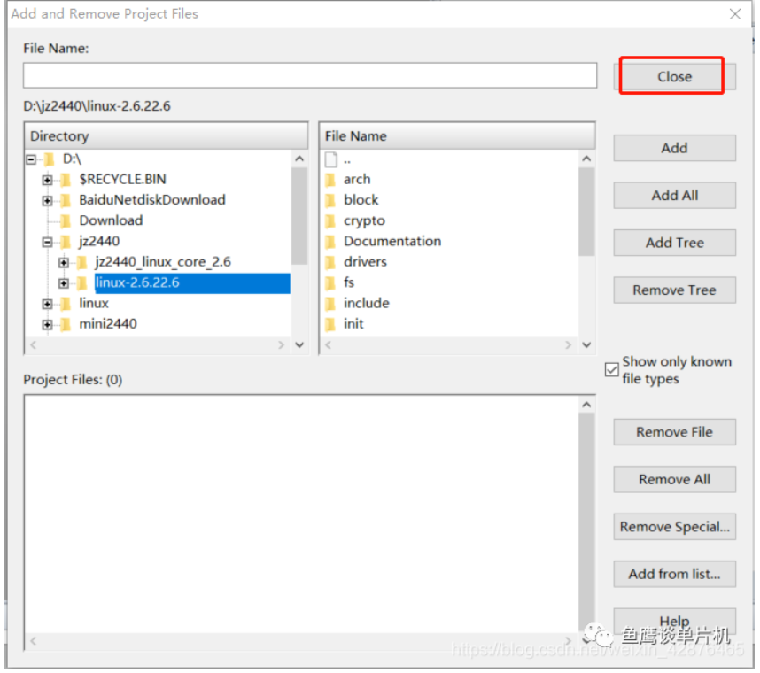

然后关闭整个工程（必须操作）。

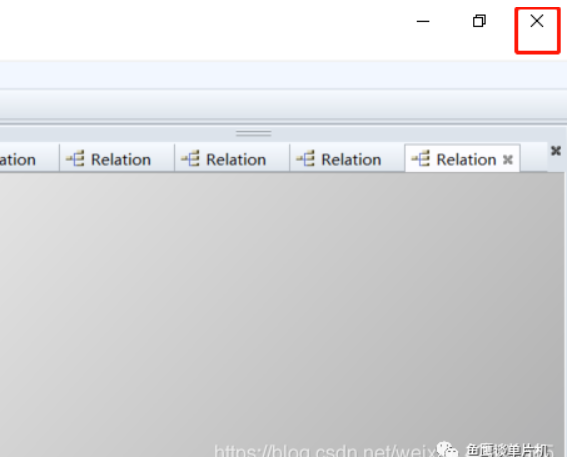

然后从 si 文件夹中重新打开工程：

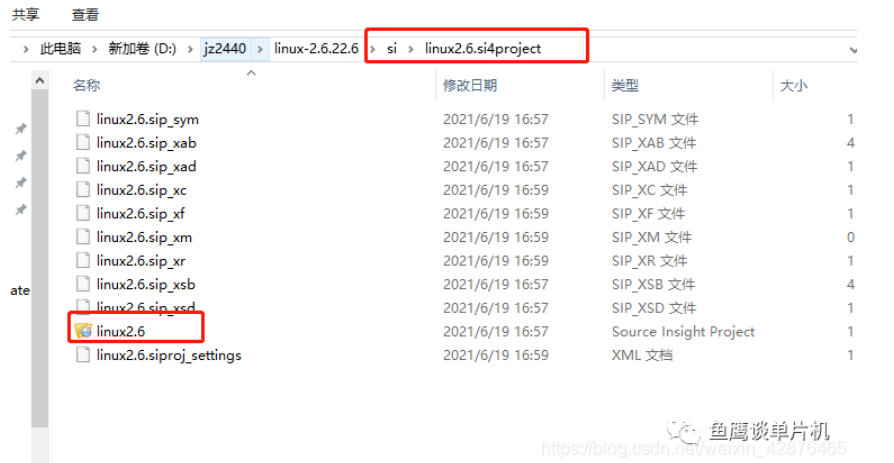

修改工程路径为相对路径

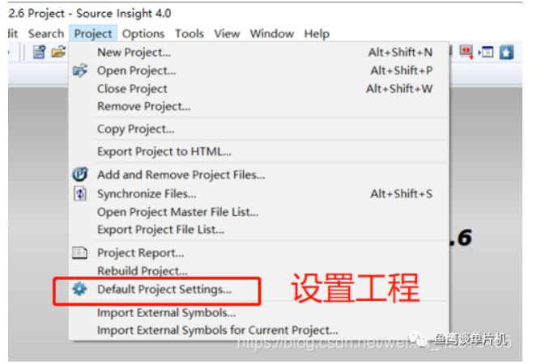

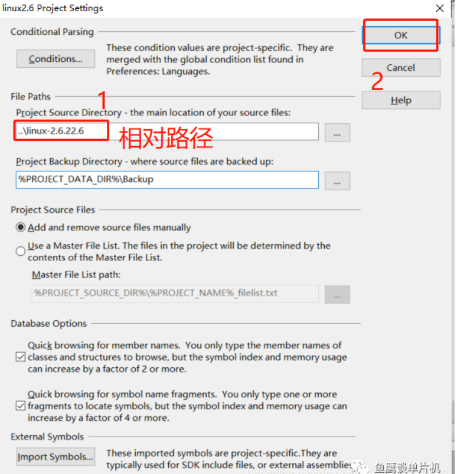

此时，如果前面的步骤没有问题，那么你看到的文件路径应该是一个相对路径：

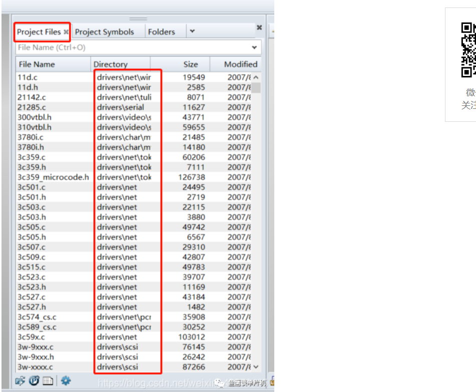

**关闭工程**，此时相对路径的设置就已经保存好了，你可以把这个 linux-2.6.22.6 **文件夹**复制到任何文件夹下（或者简单的给文件夹换个名字，比如 linux-2.6.22.6 改成 linux2.6），然后再次打开这个工程，你会发现，你很顺利的打开了这个文件，并且你添加的文件也还在。如果你当时还同步了文件，那么你的同步信息也是可以正常使用的，不需要再次进行同步。

相当爽！！！可以早点下班咯！

另外 git 管理时，可以只跟踪这些文件（不包含同步信息，即函数调用关系）：

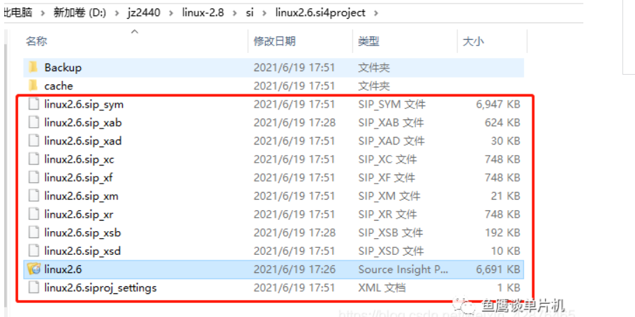

另外再和大家介绍一个新技能，可以建立多个函数的调用关系图，这样就不怕函数太多，看不过来了。

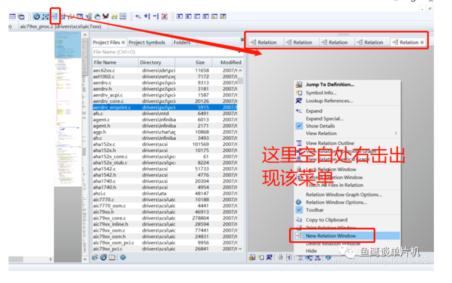