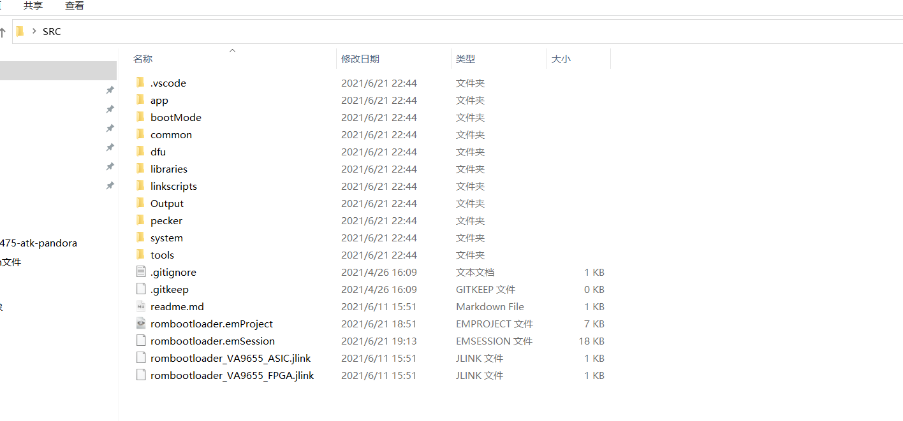
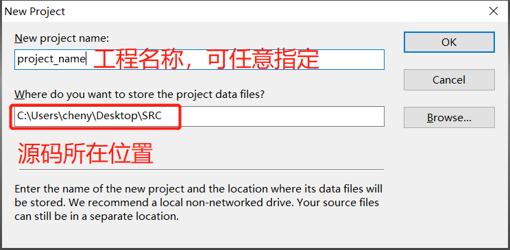
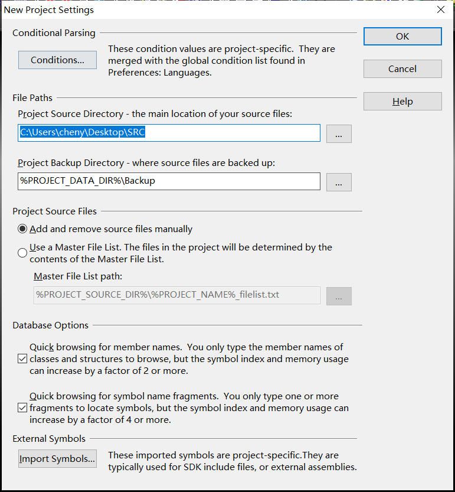
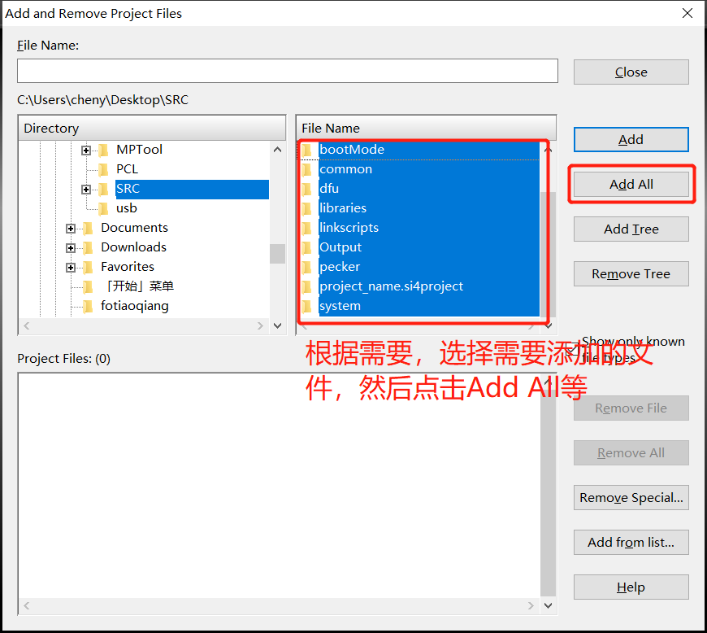
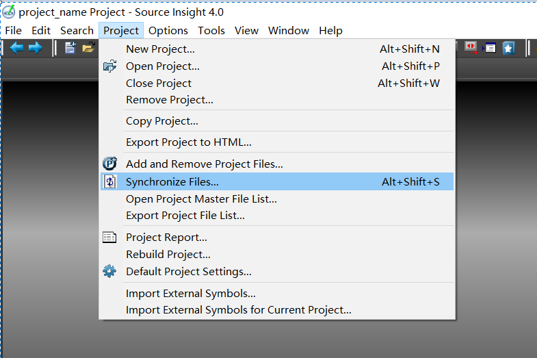
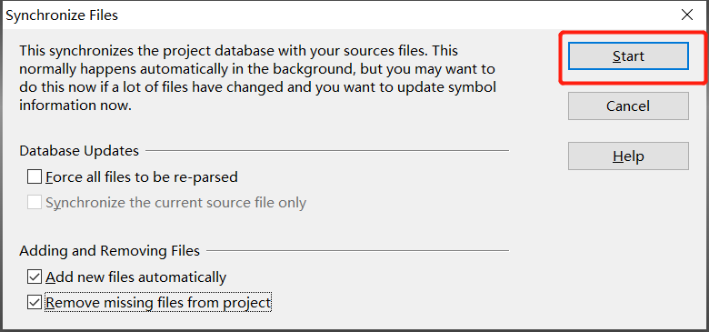
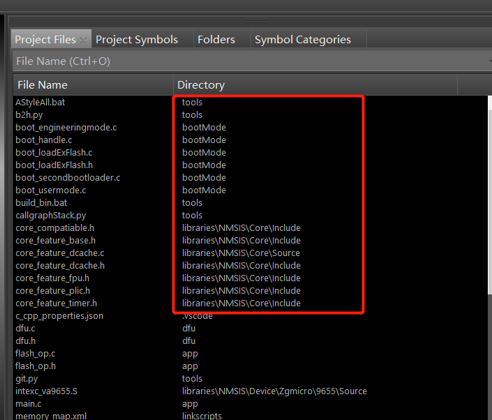

### SI4 相对路径设置

你的 SI 工程是不是换个目录就不能用了？每次 clone 下来的代码都要重新新建 SI 工程？接下来我们使用SI创建工程，可以移动文件夹，但是不需要重新创建SI工程

比如在桌面上有一个文件夹 SRC  ，路径为： C:\Users\cheny\Desktop\SRC ， 注意文件路径不可以有中文

- 新建工程，输入工程名称，以及源码所在位置，点击OK，注意，存放project data files的位置，一定要是源码根目录位置，这样，新建的SI工程，就不需要繁琐设置，达到相对路径工程的效果

  

- 接着出现如下对话框，直接点击OK

  

- 添加文件，最后点击Close
- 

- 点击完close后，手动解析工程，点击Synchronize Files

  

- 点击Start

  

- 确认是否为相对路径，Directory一列，没有绝对路径，即为相对路径工程新建成功，拷贝工程到其他地方试试吧

  