# ubuntu vscode快捷键整理

## 熟悉的一些快捷键用法

1. CTRL+F 搜索当前文件内容

2. CTRL+H 文件内替换

3. CTRL+SHIFT+F 全文搜索内容

## 不熟悉的一些快捷键用法

1. **CTRL+P 全局搜索文件,和sourceinsight 的ctrl+O的功能一样**
2. **ALT+上下箭头  将当前行上下移动行**
3. 禁用RADEON OVERLAY。
4. CTRL+左右箭头  以单词为单位移动光标
5. CTRL+HOME  移动光标至文件起始位置
6. CTRL+END 移动光标至文件末位置
7. CTRL+PgUP/PgDOWN 切换已经打开的窗口,和ubuntu的terminal一致
8. **ALT+SHIFT鼠标左键 功能类似与列选项,可以多行同时输入相同的文字**
9. **CTRL+B 打开和关闭侧边栏, 在markdown环境中,被修改成了其他**
10. **CTRL+J 打开或者关闭控制台**
11. CTRL+ \  分屏
12. CTRL+=/- 字体放大,字体缩小
13. **F11 全屏**
14. CTRL+SHIFT+T 打开最近关闭的一个文件
15. **CTRL+ENTER 类似与vi的O, 就是不管当前光标在哪,总是切换到下一行**
16. **CTRL+R 打开最近打开的文件夹, 文件**
17. CTRL+SHIFT+V 预览markdown文件
18. CTRL+BACKSPACE 删除光标之前的一个单词
19. CTRL+DELETE 删除光标之后的一个单词
20. **ALT+O 打开头文件对应的源文件，或者反向**
21. CTRL+SHIFT+A 多行注释/**/ 
22. **CTRL+SHIFT+O 搜索当前文件中的全局符号**  CTRL+P 输入@, 或者CTRL+P输入@:
23. CTRL+P输入#或者快捷键CTRL+T   根据名字查找符号

24. 打开一个新窗口： Ctrl+Shift+N
25. 关闭窗口： Ctrl+Shift+W
26. 折叠打开代码块 Ctrl+Shift+[， Ctrl+Shift+]
27. 向上向下复制一行： Shift+Alt+Up或Shift+Alt+Down
28. 在当前行下边插入一行Ctrl+Enter
29. 在当前行上方插入一行Ctrl+Shift+Enter
30. 同时选中所有匹配的，或者 在选中的文本的相同内容处出现光标 Ctrl+Shift+L
31. 定义处缩略图：只看一眼而不跳转过去Alt+F12
32. 列出所有的引用：Shift+F12
33. 预览markdownCtrl+Shift+V
34. 打开快捷键表 CTRL+K CTRL+S

## VSCODE 排除相关

搜索排除

在搜索栏 排除，输入文件夹或者文件名加逗号‘,’分割

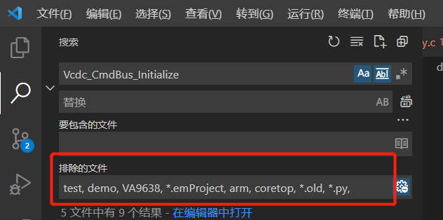


CTRL+SHIFT+P 快捷键调用出 

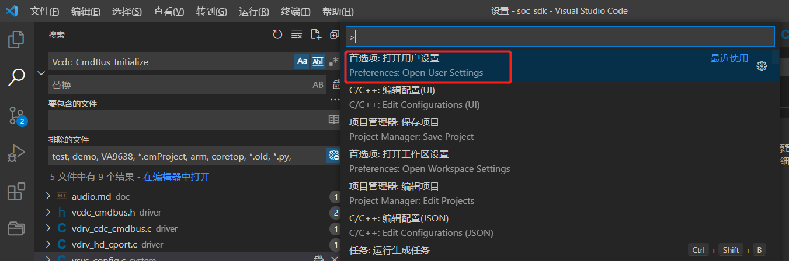


然后搜索exclude，选择工作区

如下exclude是排除的，资源管理器，显示的文件或者文件夹

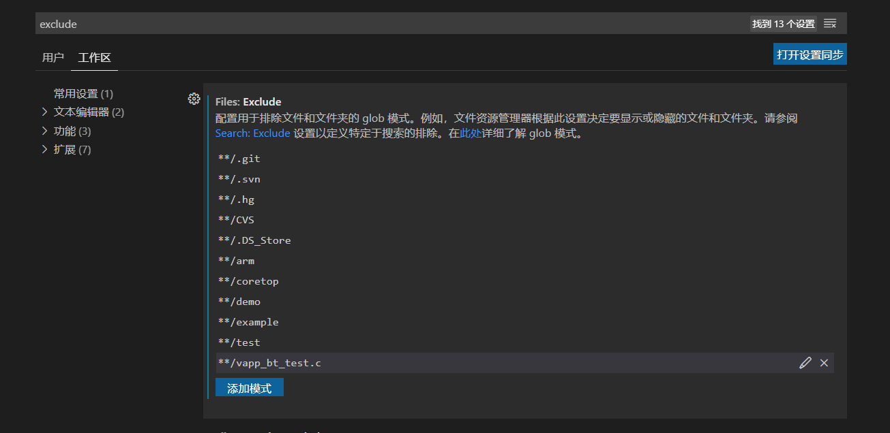


比如

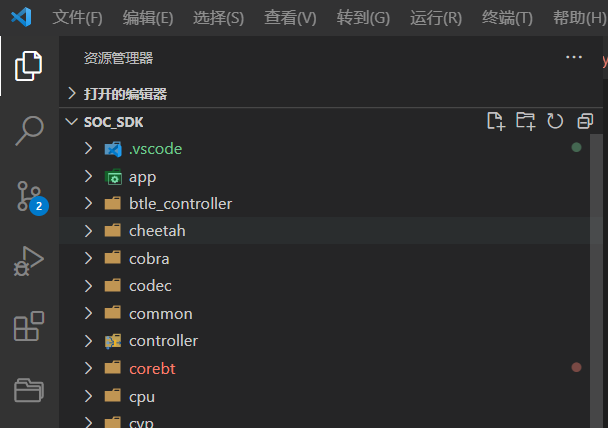


下图中的search.exclude，排除的是CTRL+P,即全局搜索文件时，起作用

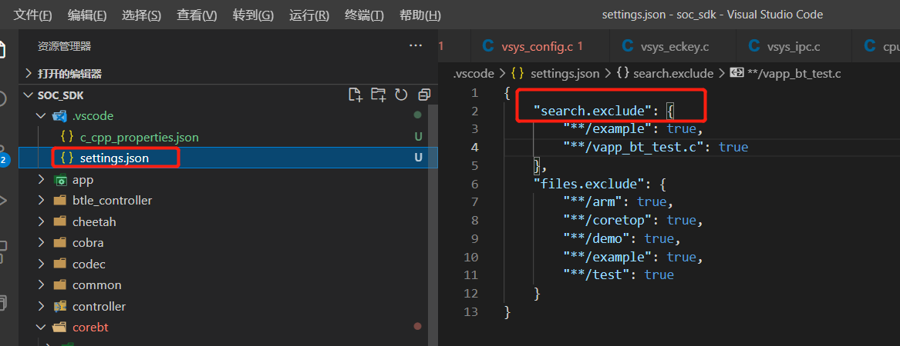

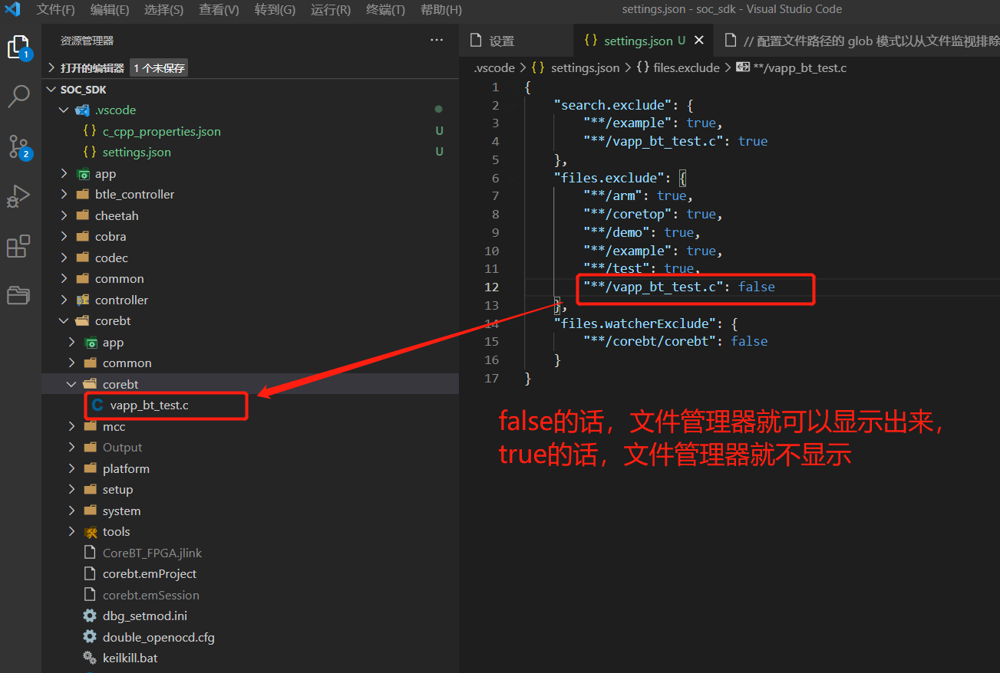


setting.json


```c
{
    // 如果字段为true，那么搜索关键字时，排除该文件，或者文件夹，ctrl+p搜索文件名时，也会排除
    "search.exclude": {
        "**/example": true,
        "**/test": true,
        "**/demo": true,
        "**/VA9638": true,
        "**/*.emProject": true,
        "**/arm": true,
        "**/*.old": true,
        "**/*.py": true,
        //"**/*.{emProject, old, py}" : true,  同时排除多个后缀
        "**/vapp_bt_test.c": false
    },

    // 如果字段为true,表示左侧资源管理器中将不再显示该文件或者文件夹,但是搜索关键字，或者文件名，仍然可以搜索到
    "files.exclude": {
        "**/arm": true,
        "**/coretop": true,
        "**/demo": true,
        "**/example": true,
        "**/test": true,
        "**/vapp_bt_test.c": true,
    },

    "files.watcherExclude": {
        "**/corebt/corebt": true,
        "**/vapp_bt_test.c": true
    }
}
```


系统设置setting.json 路径：

```
C:\Users\cheny\AppData\Roaming\Code\User
```

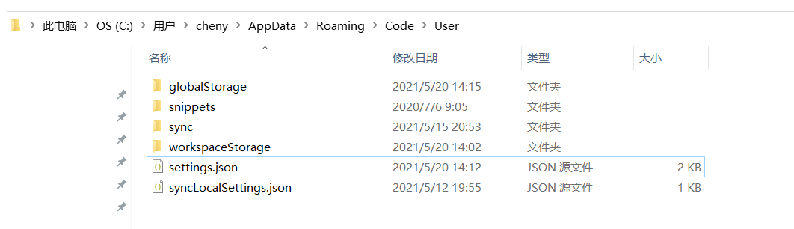


## VSCODE设置


[参考链接](https://www.cnblogs.com/qianguyihao/archive/2019/04/18/10732375.html)

vscode 设置参考 [设置参考](https://www.cnblogs.com/qianguyihao/archive/2019/04/18/10732375.html)


[Web/01-VS Code的使用.md at master · qianguyihao/Web (github.com)](https://github.com/qianguyihao/Web/blob/master/00-前端工具/01-VS Code的使用.md)


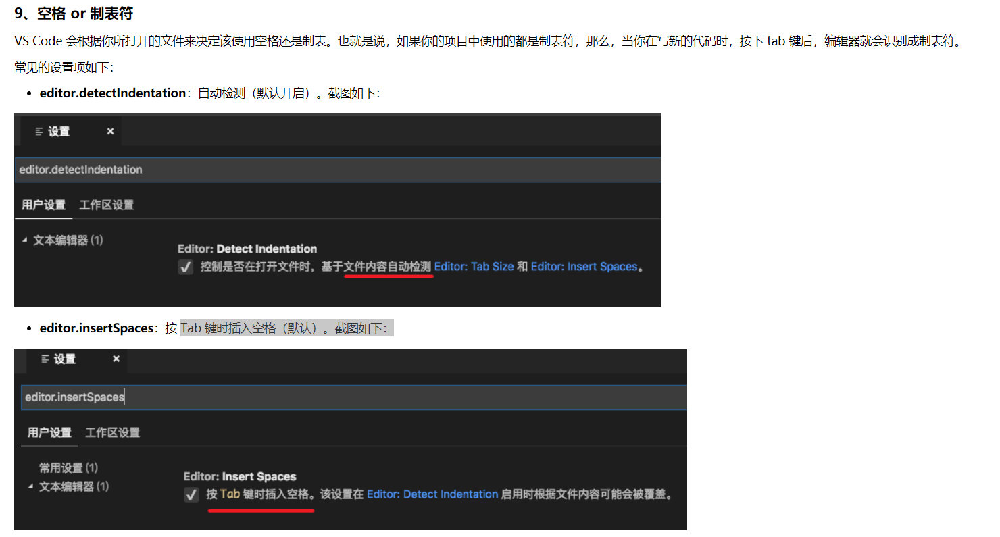


14、鼠标操作

- 在当前行的位置，鼠标三击，可以选中当前行。
- 用鼠标单击文件的**行号**，可以选中当前行。
- 在某个**行号**的位置，**上下移动鼠标，可以选中多行**。

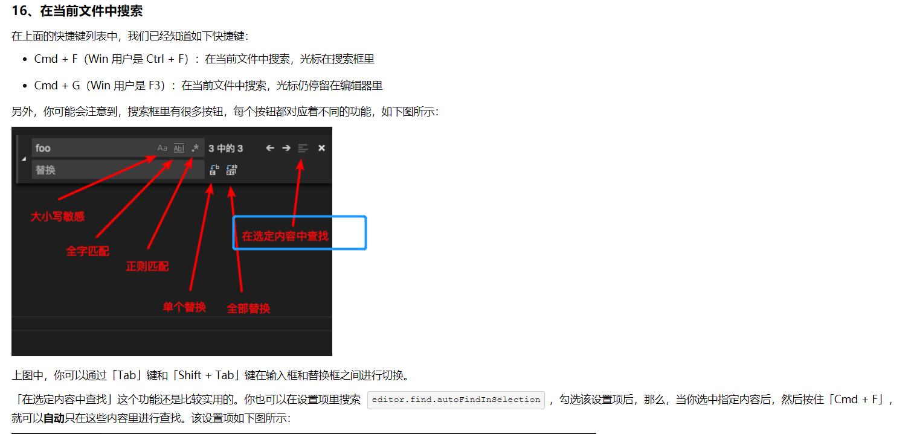

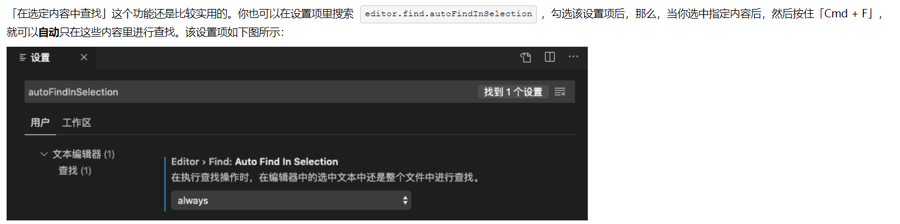

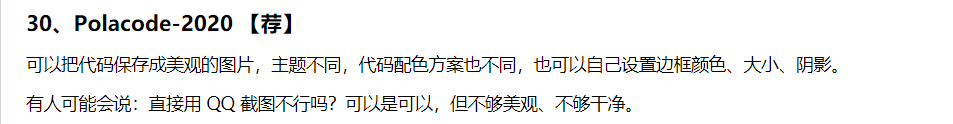


文件排除，搜索排除设置, 这里部分使用了正则表达式


```json
{
    "files.exclude": {
        "**/.git": true,		// **/.git 表示任意目录下的.git目录
        "**/.svn": true,
        "**/.hg": true,
        "**/CVS": true,
        "**/.DS_Store": true,
        "**/bsp/[^s]*":true,    // 匹配bsp/下以s开头以外的所有
        "**/bsp/s[aiemwy]*":true,	// 匹配bsp/下, 以s开头，接下来一个字符为aiemwy中的任意一个，*接下来所有任意字符
        "**/bsp/s[aiemwy]*":true,
        "**/bsp/stm32/stm32[^h]*":true,
        "**/bsp/stm32/stm32h7[4]*":true,
        "**/bsp/stm32/stm32h750-armfly-h7-tool":true,
        "**/templates/": true			// 任意目录下的templates

        // "**/bsp/[a-rCt-z]*":true,
        // "**/bsp/s[aeimwy]*":true,
        // "**/bsp/stm32/stm32[fghmw]*":true,
        // "**/bsp/stm32/stm32l[0-3]*":true,
        // "**/bsp/stm32/stm32l4[0-6r9]*":true,
        // "**/bsp/stm32/stm32l47[6]*":true,
        // "**/bsp/stm32/stm32l475-st-discovery":true,
        // "**/bsp/stm32/libraries/templates": true,
        "**/bsp/stm32/stm32l475-atk-pandora/board/CubeMX_Config/Src/main.c": true,
        "**/bsp/stm32/stm32l475-atk-pandora/board/CubeMX_Config/Inc/main.h": true
    },

    "search.exclude": {
        "**/node_modules": true,
        "**/bower_components": true,
        "**/*.code-search": true,
        "**/bsp/[^s]*":true,
        "**/bsp/s[aiemwy]*":true,
        "**/bsp/s[aiemwy]*":true,
        "**/bsp/stm32/stm32[^h]*":true,
        "**/bsp/stm32/stm32h7[4]*":true,
        "**/bsp/stm32/stm32h750-armfly-h7-tool":true,

        // "**/bsp/[a-rCt-z]*":true,
        // "**/bsp/s[aeimwy]*":true,
        // "**/bsp/stm32/stm32[fghmw]*":true,
        // "**/bsp/stm32/stm32l[0-3]*":true,
        // "**/bsp/stm32/stm32l4[0-6r9]*":true,
        // "**/bsp/stm32/stm32l47[6]*":true,
        // "**/bsp/stm32/stm32l475-st-discovery":true,
        "**/bsp/stm32/libraries/templates": true,
        "**/bsp/stm32/stm32l475-atk-pandora/board/CubeMX_Config/Src/main.c": true,
        "**/bsp/stm32/stm32l475-atk-pandora/board/CubeMX_Config/Inc/main.h": true
    }
}
```


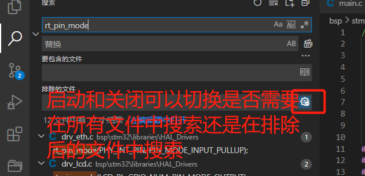