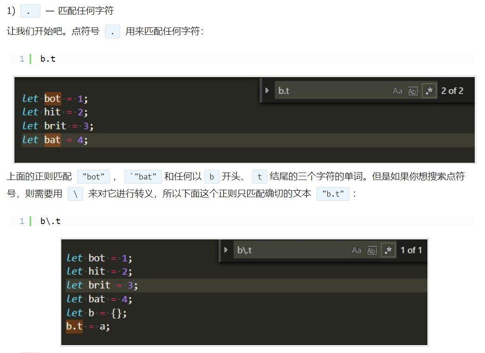
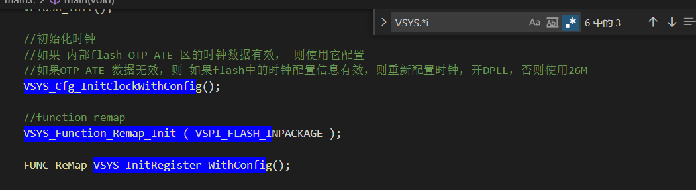
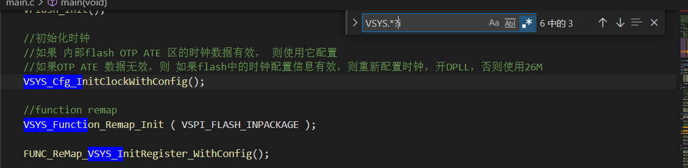
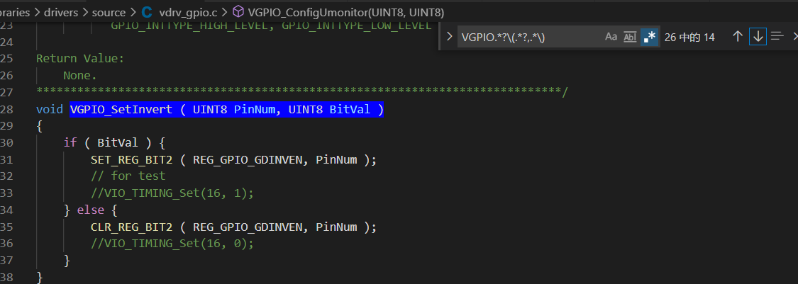
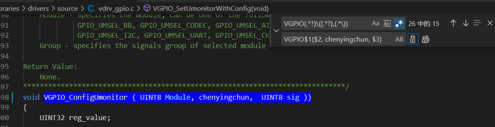

# 正则表达式

参考链接： [正则表达式](https://www.jb51.net/article/161215.htm)

1. 点号‘.’ 表示通配符，用来匹配任意字符，一个点表示匹配任意一个字符，2个点表示匹配两个，等等

   

2. 上面的一个点号，只能匹配任意一个字符，那么想任意匹配多个字符怎么办呢？可以使用点号+星号，即‘.*’

   表示匹配任意多个字符

   


3. 上面点号+星号，匹配的是最后一次出现比如i的地方，但是，当想匹配最早一次出现i的时候就停止，怎么办呢？可以加上问号？， 问号的语义是尽量少的匹配

   


4. 解析下面的正则表达式

   VGPIO开头，接着匹配任意个数字符一直到第一个(,接着匹配任意字符，一直到第一个逗号，紧接着匹配任意字符到第一个)

   


5. 括号，括号表示捕获匹配到的字符，用$1，$2等代替，比如	

   ```
   VGPIO(.*?)\((.*?),(.*\))
   VGPIO$1($2, chenyingchun, $3)
   
   其中\( 表示(的转义，()则表示捕获，按照顺序，分别可以使用$1等表示
   ```

   


6. [] 字符类， 可以在中括号内，列出需要匹配的特殊字符，比如[0-9]表示匹配0~9所有的数字， 也可以使用[0123456789]表示相同的含义，[a-z] 匹配所有的小写字母， [A-Z]匹配所有的大写字母，[a-zA-Z] 匹配所有的字母